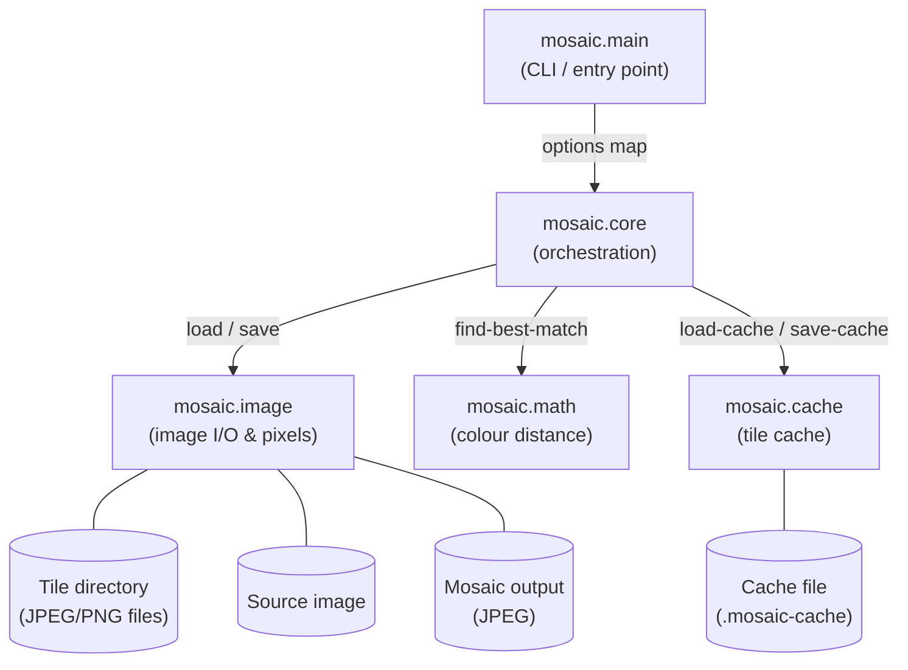
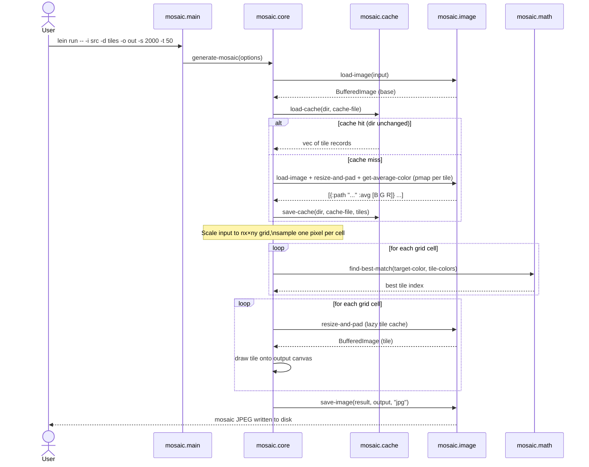

# Mosaic Architecture

## Overview

The mosaic generator takes a source image and a directory of tile images, then
assembles a photo mosaic by replacing each cell of a scaled-down grid with the
tile whose average colour most closely matches that cell.

The application is structured as five namespaces, each with a single
responsibility:

| Namespace | Role |
| --------- | ---- |
| `mosaic.main` | CLI entry point — parses arguments and delegates to `core` |
| `mosaic.core` | Orchestration — loads tiles, builds the grid, assembles the mosaic |
| `mosaic.image` | Image I/O and pixel-level operations (load, save, resize, colour) |
| `mosaic.math` | Colour distance calculation using the Redmean metric |
| `mosaic.cache` | Tile metadata persistence — avoids re-scanning unchanged directories |

## Component Diagram



## Sequence Diagram



## Data Structures

### CLI options map

Produced by `clojure.tools.cli/parse-opts` and passed directly into
`generate-mosaic`:

```clojure
{:input     "test.jpg"       ; path to source image
 :directory "images"         ; tile directory
 :output    "out.jpg"        ; output path
 :size      2000             ; longest dimension of the mosaic (pixels)
 :tile      50}              ; width and height of each square tile (pixels)
```

### Tile record

A plain map stored in the cache and used during colour matching:

```clojure
{:path "/abs/path/to/tile.jpg"
 :avg  [42.1 87.3 130.6]}    ; average colour as [B G R] doubles
```

### Cache file (EDN)

Written to `.mosaic-cache` beside the tile directory:

```clojure
{:hash  -1234567890          ; hash of filenames + last-modified times
 :tiles [{:path "..." :avg [...]} ...]}
```

### Colour vector

All colour values are represented as a **primitive `double[]` of length 3** in
BGR channel order `[B G R]`, matching the layout returned by `java.awt` pixel
operations.

## Key Classes (Java interop)

| Java class | Where used | Purpose |
| ---------- | ---------- | ------- |
| `java.awt.image.BufferedImage` | `image`, `core` | In-memory raster image |
| `java.awt.Graphics2D` | `image`, `core` | 2-D drawing context for resize and assembly |
| `java.awt.Color` | `image` | Background fill colour during padding |
| `java.awt.RenderingHints` | `image` | Quality hints for image scaling |
| `javax.imageio.ImageIO` | `image` | JPEG/PNG read and write |
| `java.io.File` | `image`, `cache`, `core` | File-system path references |

## Colour Distance: Redmean Metric

Tile matching uses the *Redmean* approximation to perceptual colour distance
(implemented in `mosaic.math/redmean-distance-sq`):

$$
d^2 = \left(2 + \frac{\bar{r}}{256}\right)\Delta r^2
    + 4\,\Delta g^2
    + \left(2 + \frac{255 - \bar{r}}{256}\right)\Delta b^2
$$

where $\bar{r} = \frac{r_1 + r_2}{2}$ is the mean red channel value. The
squared distance is used throughout to avoid an unnecessary square-root during
the search.
